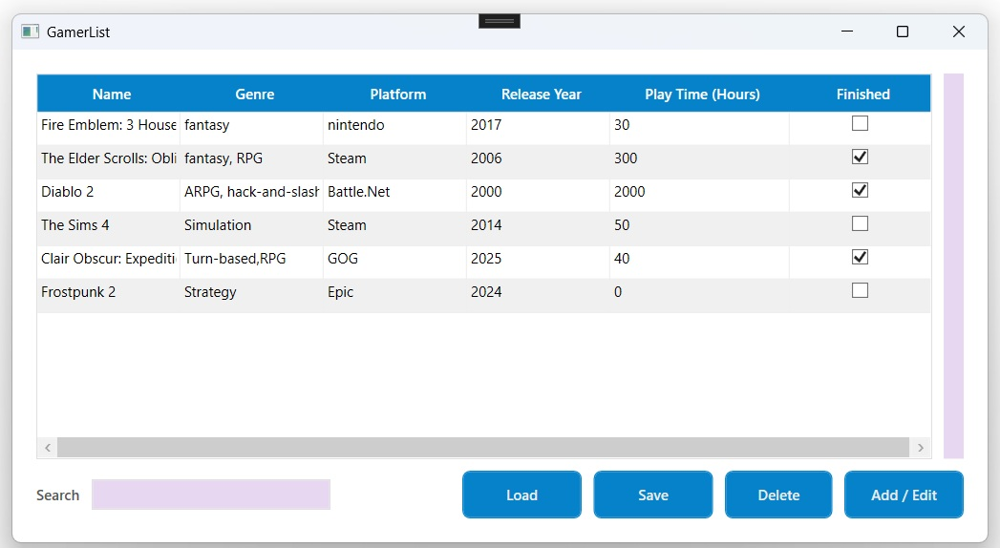
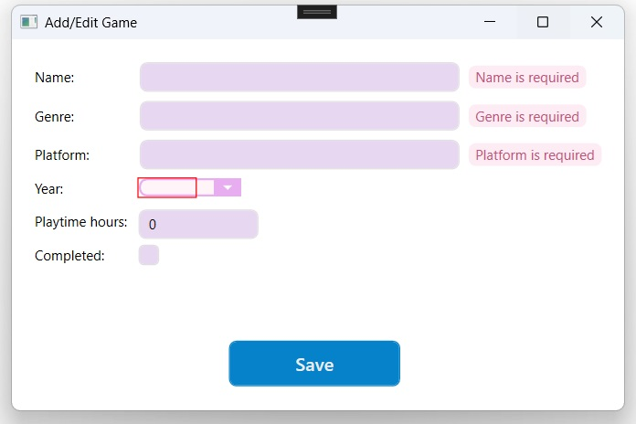
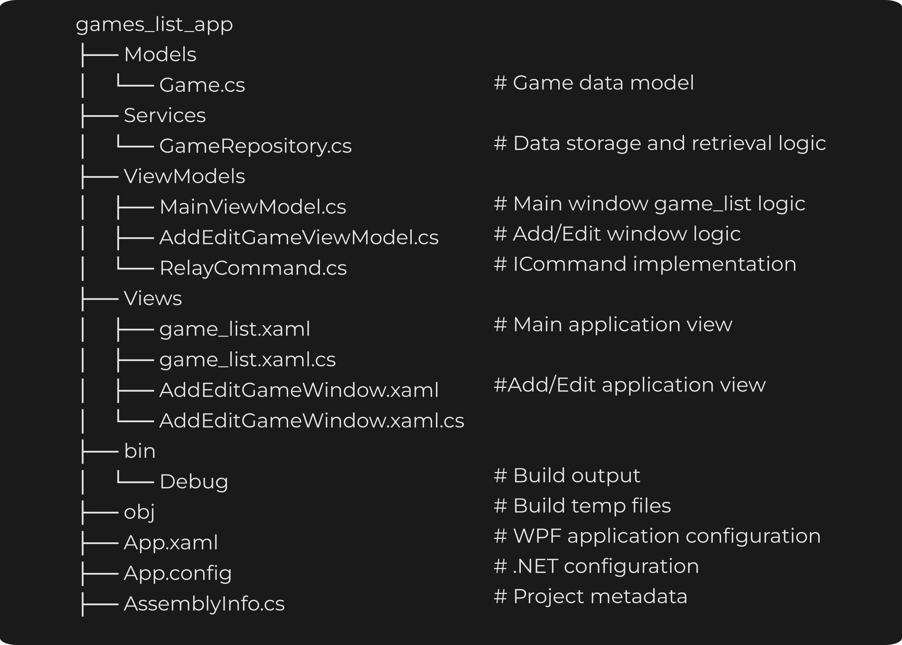

# games_list_app

## Screenshots 
1. Main window

2. Add/Edit window

# Technologies Used:
1. #C / .Net
2. local database SQL

# Project structure:
1. Main window - data grid with search, delete, add game function plus save and load games from local SQL server
2. Add/Edit window - form with validations

# Features:
1. save and load games from local SQL server
2. search bar
3. adding/edit/delete existing game

# Folder Structure:

# Author:
Kinga Prochowicz

# License:  
This project is intended for personal and portfolio use.

